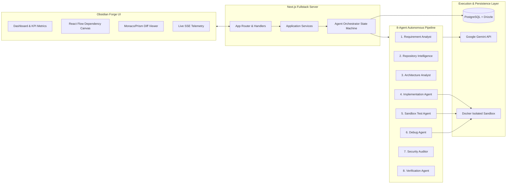
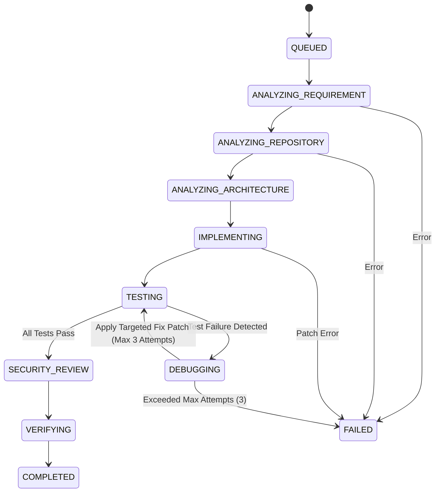

# Wizard Pilot System Architecture Documentation

## 1. System Overview

Wizard Pilot is built as a modular monolith Next.js application combining real-time Server-Sent Events (SSE), an 8-agent state machine orchestrator, an isolated sandbox execution runtime, and a PostgreSQL database managed via Drizzle ORM.

---

## 2. Orchestrator State Machine

The agent orchestrator transitions through a deterministic state machine:

---

## 3. Sandboxed Execution Isolation

Untrusted repository code is strictly isolated inside ephemeral Docker containers:
- **Non-root user**: Container executes under UID 1001 (`sandboxuser`).
- **Resource Constraints**: Strict memory (1GB) and CPU (2 cores) limits.
- **Network Policy**: Isolated bridge network without access to the host Docker daemon socket.
- **Command Allowlist**: Strict binary allowlist (`npm`, `pnpm`, `yarn`, `mvn`, `gradle`, `node`, `java`, `pytest`, `cargo`).
- **Dangerous Pattern Rejection**: Immediate blocking of shell injection patterns (`rm -rf /`, `curl | sh`, `sudo`, `docker`).
