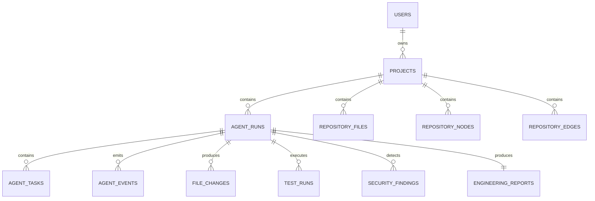

# Wizard Pilot Database Architecture

## 1. Entity Relationship (ER) Diagram

---

## 2. Table Specifications

1. `users`: Stores user profile and AES-256-GCM encrypted GitHub tokens.
2. `projects`: Connected GitHub repositories, metadata, branch configurations.
3. `agent_runs`: Orchestrated autonomous engineering runs, state machine status, and confidence scores.
4. `agent_tasks`: Granular agent task execution metrics.
5. `agent_events`: Real-time Server-Sent Events telemetry feed.
6. `repository_nodes` & `repository_edges`: React Flow architecture dependency graph.
7. `file_changes`: Atomic Git diffs and patch records.
8. `test_runs` & `test_results`: Sandbox test suite outputs and stack traces.
9. `security_findings`: Static vulnerability detections and remediation guidance.
10. `engineering_reports`: Final verified engineering audit documents.
